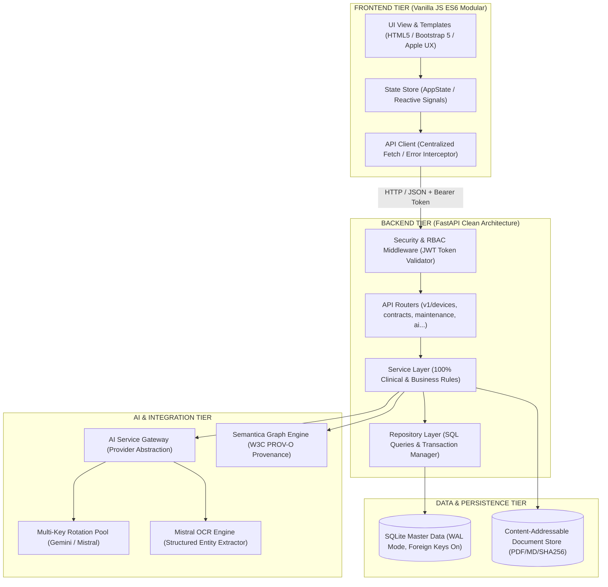
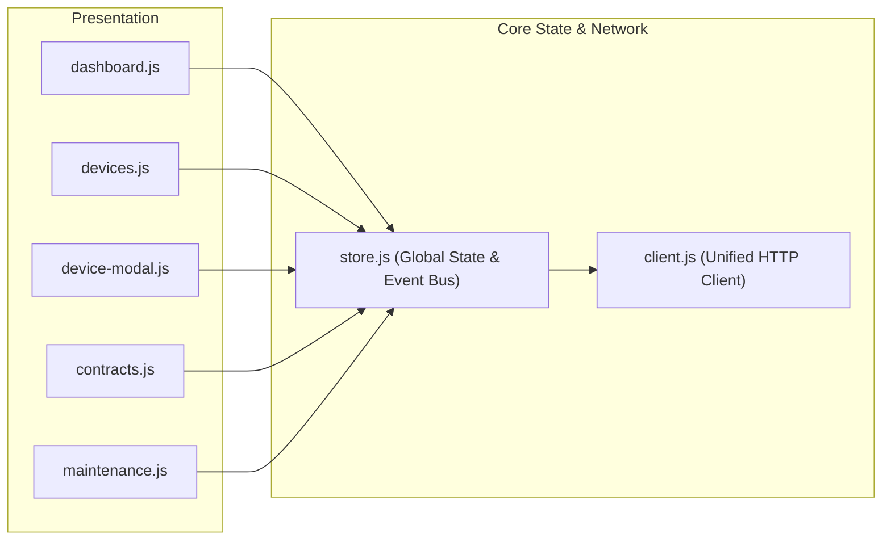
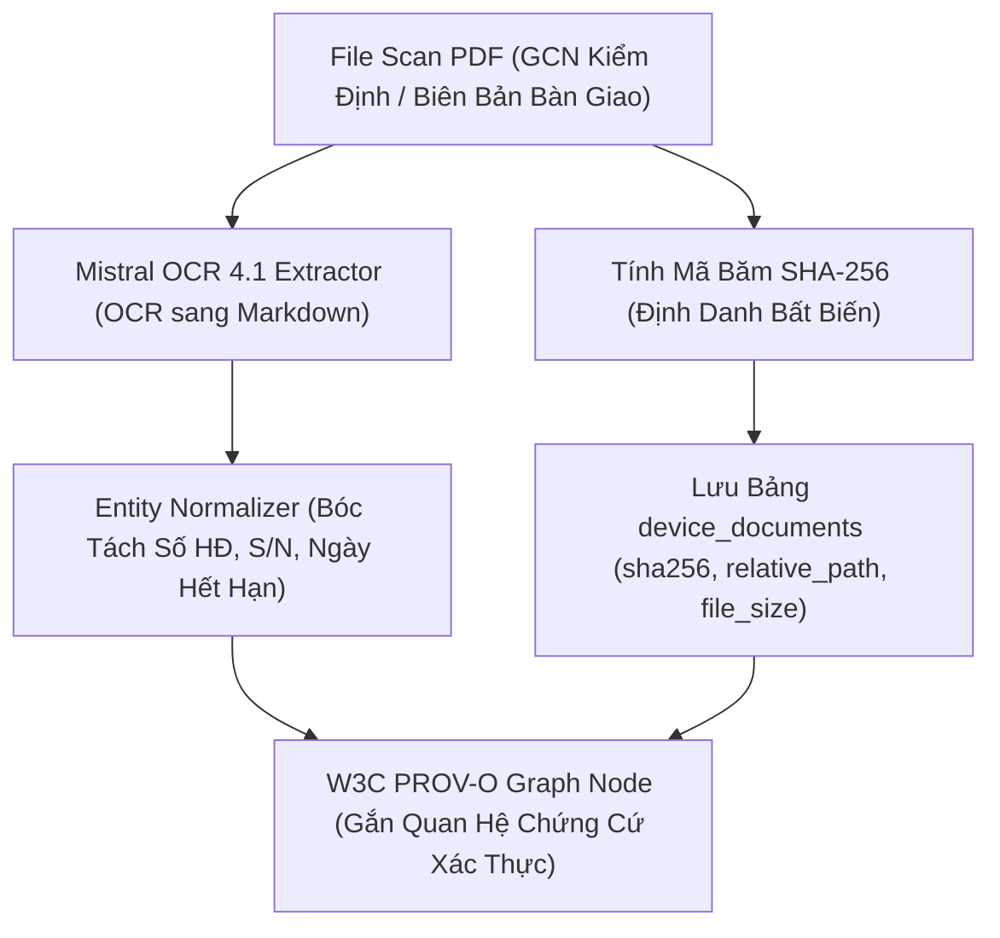

# 🏛️ THIẾT KẾ KIẾN TRÚC MỤC TIÊU (TARGET ARCHITECTURE DESIGN)
## HEALTH TECHNOLOGY MANAGEMENT SYSTEM (HTM V3) — BV QUẬN 7

> **Tầm nhìn:** Chuyển đổi toàn diện từ kiến trúc tệp đơn khối (Monolithic File) sang kiến trúc phân tầng chuyên nghiệp (Layered Clean Architecture), phân tách độc lập giữa Tầng Giao Diện, Tầng Nghiệp Vụ Lâm Sàng, Tầng Truy Cập Dữ Liệu và Tầng Tích Hợp AI/OCR.

---

## 1. TỔNG THỂ KIẾN TRÚC HỆ THỐNG (SYSTEM OVERVIEW)



---

## 2. CHI TIẾT CÁC TẦNG KIẾN TRÚC (ARCHITECTURAL LAYERS)

### A. TẦNG BACKEND (FASTAPI LAYERED ARCHITECTURE)

1. **API Routers (`app/api/v1/`)**:
   * Chỉ làm nhiệm vụ tiếp nhận Request, chuyển đổi DTO sang Pydantic Models, gọi Service và trả về Response chuẩn HTTP (200, 201, 400, 404, 500).
   * Tuyệt đối không chứa câu lệnh SQL hoặc logic nghiệp vụ tính toán.
2. **Service Layer (`app/services/`)**:
   * Nơi lưu trữ 100% quy tắc nghiệp vụ y tế:
     * `DeviceService`: Sinh mã Asset Tag, phân loại rủi ro A/B/C/D, kiểm tra ràng buộc điều chuyển (QT.08).
     * `MaintenanceService`: Lập lịch PM định kỳ (QT.06), tính chỉ số MTBF/MTTR, quản lý Work Orders SpeedMaint.
     * `CalibrationService`: Cảnh báo hết hạn kiểm định (TT 05/2022/TT-BYT), tính số ngày còn lại.
     * `DocumentService`: Quản lý định danh tài liệu, tính mã hash SHA256, đối soát liên kết chứng từ.
3. **Repository Layer (`app/repositories/`)**:
   * Đóng gói toàn bộ các câu lệnh SQL vào các hàm chuyên biệt (`get_by_id`, `search_devices`, `create_with_transaction`).
   * Đảm bảo tính ACID: Mọi thao tác ghi liên bảng (ví dụ: Chuyển khoa -> Ghi lịch sử transfer -> Cập nhật vị trí thiết bị) phải chạy trong một Database Transaction duy nhất.
4. **Database Access (`app/database.py`)**:
   * Quản lý kết nối SQLite thread-safe, kích hoạt `PRAGMA foreign_keys = ON;` và `PRAGMA journal_mode = WAL;`.
   * Hỗ trợ chuyển đổi liền mạch sang PostgreSQL trong tương lai nếu quy mô bệnh viện vượt quá 10.000 thiết bị.

---

### B. TẦNG FRONTEND (MODULAR JAVASCRIPT & STATE MANAGEMENT)



1. **`web/js/api/client.js` (Unified HTTP Client)**:
   * Điểm duy nhất trong ứng dụng thực hiện các cuộc gọi mạng (`fetch`).
   * Tự động đính kèm `Authorization: Bearer <token>`, xử lý JSON serialization, bắt lỗi mạng và hiển thị Toast thông báo thân thiện.
2. **`web/js/state/store.js` (Centralized State)**:
   * Lưu trữ cache danh mục thiết bị, danh sách khoa phòng, danh sách hợp đồng, trạng thái bộ lọc (Search Query, Dept Filter, Risk Filter).
   * Phát sự kiện (Event Emitter) khi dữ liệu thay đổi để các UI Components tự động cập nhật mà không cần reload trang.
3. **`web/js/modules/` (Component Controllers)**:
   * Mỗi module quản lý một màn hình hoặc một modal cụ thể. Độ dài mỗi file không vượt quá 300 dòng code.

---

### C. TẦNG XỬ LÝ TÀI LIỆU & OCR PROVENANCE (CONTENT-ADDRESSABLE STORAGE)



* **Nguyên tắc bất biến**: Không lưu đường dẫn tuyệt đối phụ thuộc ký tự ổ đĩa (`G:\`, `C:\`). Lưu trữ dạng `storage_key` + `relative_path` + `sha256`.
* **Zero Hallucination**: Dữ liệu trích xuất từ tài liệu luôn có trường `source_document_sha256` và `bounding_box` để người dùng có thể nhấp chuột xem trực tiếp chứng cứ gốc.

---

### D. TẦNG TÍCH HỢP AI & KEY MANAGEMENT

```
                       ┌──────────────────────────────┐
                       │      AI Service Gateway      │
                       └──────────────┬───────────────┘
                                      │
              ┌───────────────────────┴───────────────────────┐
              ▼                                               ▼
┌──────────────────────────────┐              ┌──────────────────────────────┐
│     Gemini Clinical Agent    │              │     Mistral OCR Engine       │
│  (SOPs, Triage, Diagnostics) │              │ (Scan BM04, BM02, GCN TT05)  │
└─────────────┬────────────────┘              └──────────────┬───────────────┘
              │                                               │
              ▼                                               ▼
┌────────────────────────────────────────────────────────────────────────────┐
│              Multi-Key Rotation Pool (In-Memory + Thread-Safe)             │
│   • Auto-failover on 429/503 • Cooldown timer • Key Healthcheck • Quota    │
└────────────────────────────────────────────────────────────────────────────┘
```

1. **Provider Abstraction**: Tách biệt code gọi AI thành Interface chuẩn (`generate_text`, `extract_document`, `chat_stream`).
2. **Key Isolation**: Không bao giờ ghi trực tiếp API keys vào các bảng dữ liệu nghiệp vụ. Sử dụng cấu hình `.env` cho Production và bảng `system_vault` có mã hóa cho Dynamic Keys.
3. **Logging Sanitization**: Tự động lọc (mask) mọi chuỗi token/key trước khi ghi vào log hệ thống hoặc xuất file session.
