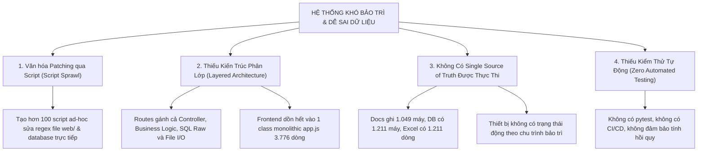

# 🏥 TOÀN DIỆN AUDIT HỆ THỐNG QUẢN LÝ TRANG THIẾT BỊ Y TẾ (HTM V3)
## BỆNH VIỆN ĐA KHOA TÂM ANH TP.HCM — PHÒNG KHÁM ĐA KHOA QUẬN 7

> **Thời điểm kiểm toán:** `19/08/2026`  
> **Repository:** `medical-device-app`  
> **Phạm vi kiểm toán:** Toàn bộ Codebase (Backend, Frontend, Database, Scripts, Docs, Specs, OCR Pipeline, AI Engine, Security, Business Workflows)  
> **Phương pháp tiếp cận:** Đối soát trực tiếp (Evidence-Based), đối chiếu CSDL thực tế, không dựa vào báo cáo cũ, phân tích nguyên nhân gốc (Root Cause Analysis).

---

## 1. TỔNG QUAN TÌNH TRẠNG HỆ THỐNG (EXECUTIVE SUMMARY)

Hệ thống Quản Lý Trang Thiết Bị Y Tế (HTM V3) là ứng dụng cốt lõi quản trị vòng đời tài sản y tế của BV Quận 7 / PKĐK Tâm Anh Quận 7. Qua đợt kiểm toán toàn diện từ tầng dữ liệu, mã nguồn, kiến trúc cho đến quy trình vận hành lâm sàng, nhóm kiểm toán xác nhận:

1. **Dữ liệu Master Data đã được nạp chuẩn hóa ở mức CSDL**:
   * CSDL thực tế `database/devices.db` chứa **1.211 Thiết Bị Y Tế**, **198 Hợp Đồng Mua Sắm**, **102 Nhà Cung Cấp / Đại Diện Hãng**, và **39 Khoa / Phòng Ban** (nạp từ MasterData V6).
   * Tuy nhiên, tồn tại sự **bất đồng bộ số liệu nghiêm trọng** giữa tài liệu tĩnh (`README.md`, `DANH_MUC_THIET_BI_Y_TE_BVQ7.md` ghi 1.049 máy, 22 khoa) và CSDL thực tế (1.211 máy, 39 khoa).

2. **Hội chứng "Script Sprawl" & Patching cục bộ**:
   * Thư mục `scripts/` phình to lên tới **101 file script Python** và **15 file dữ liệu tạm** (~70MB).
   * Xuất hiện mô hình phản tiến hóa: *"Phát hiện lỗi -> Viết một script regex sửa file HTML/JS/SQL riêng"* (18 script monkey-patch, 21 script ad-hoc SQL fix). Logic nghiệp vụ bị phân tán ra khỏi backend.

3. **Kiến trúc Monolithic phân tầng yếu**:
   * **Backend**: `app/routes.py` chứa **2.016 dòng code**, gộp chung **85 API endpoints** mà không có Service Layer hay Repository Layer. Kết nối SQLite và chuỗi truy vấn SQL raw nằm rải rác.
   * **Frontend**: `web/js/app.js` là một tệp đơn khối **3.776 dòng code** gánh toàn bộ DOM manipulation, State, Chart, Kanban, Modals. File `web/js/api.js` (195 dòng) bị **bỏ qua 100%** (59 lệnh `fetch()` trực tiếp trong `app.js`).
   * Tồn tại 2 tệp HTML tài liệu giống hệt nhau (`web/quy_trinh_ttbyt.html` và `web/sops.html` — **14.765 dòng mỗi file**).

4. **Lỗ hổng bảo mật & Xác thực**:
   * **Zero Authentication & Authorization**: Toàn bộ 85 API endpoint (kể cả xóa hợp đồng, xóa nhân sự, chỉnh sửa API Key AI) đều mở tự do không có JWT/Session/RBAC.
   * **Hardcoded Paths**: Mã nguồn backend hardcode đường dẫn ổ đĩa Windows tuyệt đối (`G:\BV QUẬN 7`, `C:\Users\tantt\...`), làm mất khả năng chạy containerized / cloud production.

5. **Thiếu vắng hạ tầng kiểm thử tự động (Zero Automated Tests)**:
   * Dự án hoàn toàn **không có thư mục `tests/`** và không sử dụng test framework chuẩn (`pytest`).
   * 16 file `test_*.py` trong `scripts/` chỉ là script chạy thủ công ngắt quãng.

---

## 2. MA TRẬN PHÂN LOẠI PHÁT HIỆN KIỂM TOÁN (AUDIT FINDINGS MATRIX)

| Mã | Hạng Mục | Loại Vấn Đề | Mức Độ Nghiêm Trọng | Bằng Chứng Thực Tế (Evidence) | Nguyên Nhân Gốc (Root Cause) |
| :--- | :--- | :--- | :---: | :--- | :--- |
| **F-01** | Source of Truth | Documentation Inconsistency | **HIGH** | `README.md` & `docs/DANH_MUC...` ghi 1.049 máy; DB thực tế có 1.211 máy. | Thiếu quy trình đồng bộ tự động giữa DB và tài liệu. |
| **F-02** | Database Integrity | Data-Quality Issue | **HIGH** | 100% (1.211/1.211) thiết bị có status tĩnh `'IN_SERVICE'`; `pdf_path` & `md_path` = 0/1.211. | Import thiếu trường liên kết; trạng thái chưa gắn với workflow thực. |
| **F-03** | Missing Tables | Technical Debt | **HIGH** | Routes gọi bảng `work_orders` nhưng bảng không tồn tại trong `devices.db`. | Schema CSDL và Routes không đồng bộ qua migration tool (Alembic). |
| **F-04** | Duplicate Database | Technical Debt | **MEDIUM** | Tồn tại `app/medical_devices.db` (2 bảng cũ) song song với `database/devices.db`. | Tàn dư của phiên bản V1 chưa được dọn dẹp. |
| **F-05** | Backend Architecture | Design Weakness | **HIGH** | `app/routes.py` dài 2.016 dòng, 85 endpoints, raw SQL trực tiếp. | Thiếu Service Layer & Repository Pattern. |
| **F-06** | Hardcoded Paths | Technical Debt | **HIGH** | `PDF_ROOT_DIRS` hardcode ổ `G:\` và thư mục `C:\Users\tantt\...`. | Cấu hình không thông qua `.env` / Config Provider. |
| **F-07** | Duplicate Endpoints | Technical Debt | **MEDIUM** | `/api/semantica/stats` và `/api/semantica/explain/{id}` đăng ký 2 lần. | Merge code thiếu rà soát conflict. |
| **F-08** | Security & Auth | Vulnerability | **CRITICAL** | 85/85 endpoints mở không cần token/auth; endpoint quản lý API keys không bảo vệ. | Chưa thiết kế Authentication Middleware & RBAC. |
| **F-09** | Frontend Architecture | Design Weakness | **HIGH** | `web/js/app.js` 3.776 dòng; `api.js` bị bypass 100% (59 direct `fetch`). | Thiếu Component Architecture & State Management chuẩn. |
| **F-10** | Duplicate Large Files | Technical Debt | **LOW** | `web/quy_trinh_ttbyt.html` & `web/sops.html` trùng lặp 14.765 dòng. | Copy-paste file mà không dùng template engine / include. |
| **F-11** | Script Sprawl | Technical Debt | **HIGH** | 101 script trong `scripts/` (monkey patch, ad-hoc SQL, regex injection). | Giải quyết lỗi bằng script can thiệp nhanh thay vì refactor mã nguồn. |
| **F-12** | OCR / Provenance | Design Weakness | **MEDIUM** | File MD không có mã hash SHA256; liên kết thiết bị dựa vào chuỗi text `notes`. | Chưa có Document Registry có định danh bất biến (Content-Addressable). |
| **F-13** | AI Key Management | Technical Debt | **MEDIUM** | Key rotator ghi trực tiếp vào SQLite mà không có lock đồng thời; nguy cơ lộ token. | Quản lý key chưa tách biệt khỏi database nghiệp vụ. |
| **F-14** | Test Gap | Quality Defect | **HIGH** | Không có test suite tự động (`pytest`); không có CI pipeline. | Chưa áp dụng TDD/Automated Testing trong quy trình phát triển. |

---

## 3. NGUYÊN NHÂN GỐC RỄ (ROOT CAUSE ANALYSIS)



---

## 4. CHIẾN LƯỢC CẢI TIẾN TOÀN DIỆN (STRATEGIC ROADMAP)

Để chuyển đổi từ hệ thống "tập hợp các bản vá" thành một nền tảng **Enterprise Clinical Health Technology Management (HTM)** vững chắc, dự án cần tuân thủ lộ trình 10 giai đoạn:

```
[PHASE 0] Baseline, Khóa Schema, Khóa Source of Truth Master Data V6
    ↓
[PHASE 1] Chuẩn Hóa Toàn Vẹn Dữ Liệu (Canonical Devices, Dynamic Status, Link Docs)
    ↓
[PHASE 2] Tái Cấu Trúc Backend (API Router -> Service Layer -> Repository Pattern)
    ↓
[PHASE 3] Tái Cấu Trúc Frontend (Tách Modular JS: api, state, components, modals)
    ↓
[PHASE 4] Chuẩn Hóa Document & OCR Pipeline (Document Registry + SHA256 Provenance)
    ↓
[PHASE 5] Chuẩn Hóa AI Hub & Multi-Key Pool (Isolated Key Service, Zero Hallucination)
    ↓
[PHASE 6] Bảo Mật Toàn Diện (JWT Authentication, RBAC, Safe File Resolution)
    ↓
[PHASE 7] Xây Dựng Test Suite Tự Động (Pytest Unit, Integration, API, Playwright E2E)
    ↓
[PHASE 8] Tối Ưu Hiệu Năng (SQLite Indexes, FTS5 Search, Frontend Pagination/Virtual Scroll)
    ↓
[PHASE 9] Đóng Gói Production Hardening (Docker Multi-Stage, Healthchecks, Backup Cron)
```

---

## 5. KẾT LUẬN & CAM KẾT

* **Tuyệt đối không sửa code / xóa file / migrate DB trong đợt audit này**.
* Báo cáo này là cơ sở duy nhất để lập 9 tài liệu kế hoạch chi tiết tiếp theo. Mọi đề xuất đều có bằng chứng truy vết trực tiếp vào mã nguồn và CSDL.
