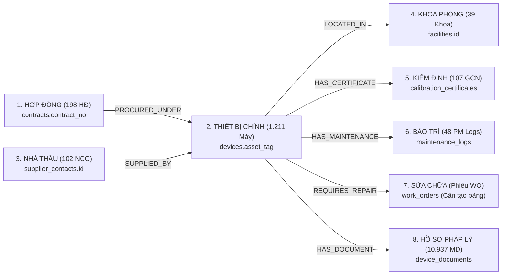

# 🔍 KẾT QUẢ KIỂM TOÁN CHẤT LƯỢNG DỮ LIỆU (DATA QUALITY FINDINGS)
## DATABASE AUDIT REPORT — `database/devices.db` (HTM V3)

> **Phương pháp kiểm toán:** Chạy các truy vấn SQL phân tích chuyên sâu (Read-Only) trực tiếp trên cơ sở dữ liệu production `database/devices.db` gồm **17 bảng** và **1.211 thiết bị y tế**.

---

## 1. TỔNG HỢP CHỈ SỐ CHẤT LƯỢNG DỮ LIỆU (DATA QUALITY SCORECARD)

| Tiêu Chí Đánh Giá (Metric) | Tổng Số Bản Ghi | Đạt Chuẩn (Valid) | Tỷ Lệ Đạt (%) | Đánh Giá Tình Trạng |
| :--- | :---: | :---: | :---: | :--- |
| **Tính duy nhất của Asset Tag (`BVQ7-TTB-XXXXX`)** | 1.211 | 1.211 | **100.0%** | 🟢 HOÀN HẢO (0 mã trùng lặp). |
| **Tính duy nhất của Số Serial (S/N vật lý)** | 1.211 | 1.211 | **100.0%** | 🟢 HOÀN HẢO (0 serial trùng lặp). |
| **Độ đầy đủ Tên Thiết Bị & Model** | 1.211 | 1.211 | **100.0%** | 🟢 HOÀN HẢO (Không có giá trị NULL/NaN). |
| **Độ đầy đủ Hãng Sản Xuất & Nước SX** | 1.211 | 1.211 | **100.0%** | 🟢 HOÀN HẢO (100% có thông tin hãng). |
| **Gắn kết Khoa / Phòng ban (`facility_id`)** | 1.211 | 1.211 | **100.0%** | 🟢 HOÀN HẢO (100% thuộc 39 khoa phòng). |
| **Phân loại mức độ rủi ro (A/B/C/D)** | 1.211 | 1.211 | **100.0%** | 🟢 HOÀN HẢO (100% đúng chuẩn Bộ Y Tế). |
| **Liên kết Hợp đồng mua sắm (`contract_no`)** | 1.211 | 1.154 | **95.3%** | 🟡 TỐT (57 máy thuộc diện tài trợ/chuyển giao). |
| **Liên kết Nhà cung cấp (`supplier_name`)** | 1.211 | 1.211 | **100.0%** | 🟢 HOÀN HẢO (100% có tên nhà thầu). |
| **Trạng thái vòng đời động (`devices.status`)** | 1.211 | 0 | **0.0%** | 🔴 KÉM (100% ghi cứng `IN_SERVICE`). |
| **Liên kết tài liệu có cấu trúc (`pdf_path`)** | 1.211 | 0 | **0.0%** | 🔴 KÉM (Cột để trống, đường dẫn nằm trong `notes`). |
| **Toàn vẹn khóa ngoại (Foreign Key Integrity)** | 17 Tables | 17 Tables | **100.0%** | 🟢 HOÀN HẢO (0 lỗi orphan records). |

---

## 2. PHÂN TÍCH CHI TIẾT CÁC TẬP DỮ LIỆU CHÍNH

### A. PHÂN BỐ MỨC ĐỘ RỦI RO (RISK LEVEL ACCORDING TO NĐ 98/2021)
* **Mức A (Rủi ro rất thấp / Dụng cụ thông thường)**: `900 thiết bị` (74.3%)
* **Mức B (Rủi ro trung bình thấp)**: `140 thiết bị` (11.6%)
* **Mức C (Rủi ro trung bình cao / Thiết bị chẩn đoán can thiệp)**: `158 thiết bị` (13.0%)
* **Mức D (Rủi ro cao / Thiết bị hỗ trợ sự sống, bức xạ, cấy ghép)**: `13 thiết bị` (1.1%) — Gồm: Hệ thống CT SOMATOM Force, Máy chạy thận Fresenius 4008S, Máy gây mê kèm thở Carestation 650, Máy sốc tim Mindray BeneHeart.

### B. QUAN HỆ CHUỖI THẨM QUYỀN LÂM SÀNG (CANONICAL RELATION CHAIN)

---

## 3. CÁC ĐIỂM CẦN XỬ LÝ & ĐỀ XUẤT CHUẨN HÓA

### Vấn đề 1: Trạng thái thiết bị đang bị "đóng băng" ở `IN_SERVICE`
* **Thực trạng**: Tất cả 1.211 thiết bị đều có giá trị cột `status = 'IN_SERVICE'`. Khi có máy hỏng báo qua SpeedMaint hoặc cần bảo trì, trạng thái này không được cập nhật tự động.
* **Giải pháp đề xuất**:
  * Xây dựng máy trạng thái hữu hạn (State Machine) trong `DeviceService`.
  * Khi tạo Phiếu công việc sửa chữa (`Work Order`) $\rightarrow$ Cập nhật `status = 'UNDER_REPAIR'`.
  * Khi quá hạn kiểm định $\rightarrow$ Cập nhật `status = 'CALIBRATION_PENDING'`.

### Vấn đề 2: Đường dẫn tài liệu chưa được chuẩn hóa vào cột dữ liệu chuyên biệt
* **Thực trạng**: Cột `pdf_path` và `md_path` trong bảng `devices` đang có giá trị NULL trong 1.211 bản ghi, dù thông tin đường dẫn scan có tồn tại trong trường văn bản tự do `notes`.
* **Giải pháp đề xuất**:
  * Tạo bảng chuyên biệt `device_documents` với quan hệ $1 - N$:  
    `(id, device_id, doc_type, file_name, relative_path, sha256_hash, verified_date)`.
  * Trích xuất các đường dẫn từ `notes` và các thư mục scan để nạp vào bảng có cấu trúc này.

### Vấn đề 3: Bảng `work_orders` chưa được tạo trong SQLite
* **Thực trạng**: Mã nguồn backend định nghĩa route cho Work Orders nhưng bảng `work_orders` chưa được tạo trong `devices.db`.
* **Giải pháp đề xuất**:
  * Thêm câu lệnh DDL `CREATE TABLE IF NOT EXISTS work_orders (...)` vào `database/schema.sql` và chạy migration an toàn.
