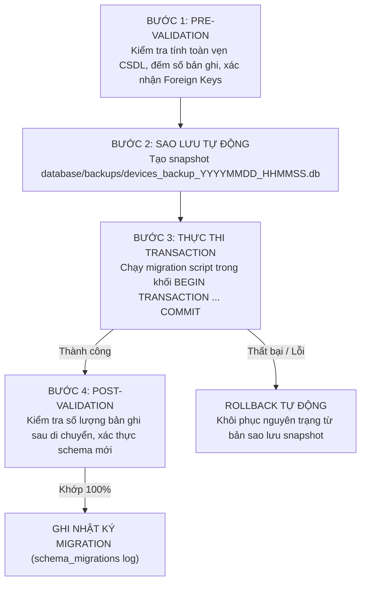

# 🔄 KẾ HOẠCH DI CHUYỂN DỮ LIỆU & SCHEMA (DATABASE MIGRATION PLAN)
## MEDICAL DEVICE MANAGEMENT SYSTEM (HTM V3) — BV QUẬN 7

> **Nguyên tắc an toàn di chuyển (Migration Safety First):**
> 1. Không bao giờ chạy migration trực tiếp trên CSDL production mà không có bản sao lưu (Backup snapshot) có gắn timestamp.
> 2. Mọi script di chuyển phải tuân thủ quy trình 4 bước: **Pre-Validation $\rightarrow$ Migration Execution $\rightarrow$ Post-Validation $\rightarrow$ Rollback Strategy**.
> 3. Không xóa dữ liệu gốc; lưu giữ bản ghi hợp nhất (Merge Provenance) để truy vết lịch sử.

---

## 1. QUY TRÌNH CHUẨN CHO MỖI ĐỢT MIGRATION



---

## 2. CHI TIẾT CÁC GIAI ĐOẠN MIGRATION (MIGRATION PHASES)

### Giai đoạn M-01: Sao lưu và dọn dẹp CSDL rác
* **Mục tiêu**: Tạo bản snapshot an toàn và dọn dẹp tệp CSDL cũ `app/medical_devices.db`.
* **Pre-validation**: Xác nhận `database/devices.db` chứa đủ 1.211 thiết bị.
* **Thực thi**:
  ```powershell
  # 1. Tạo thư mục backup và copy snapshot
  New-Item -ItemType Directory -Force -Path "database/backups"
  Copy-Item -Path "database/devices.db" -Destination "database/backups/devices_backup_$(Get-Date -Format 'yyyyMMdd_HHmmss').db"
  ```
* **Rollback Plan**: Khôi phục lại từ file backup nếu có bất kỳ sự cố nào.

---

### Giai đoạn M-02: Bổ sung bảng `work_orders` & `device_documents`
* **Mục tiêu**: Hoàn thiện schema chuẩn cho quy trình bảo trì/sửa chữa và quản lý tài liệu.
* **DDL thực thi (SQL Migration Script)**:
  ```sql
  BEGIN TRANSACTION;

  -- 1. Bảng Phiếu Công Việc Sửa Chữa (SpeedMaint Work Orders)
  CREATE TABLE IF NOT EXISTS work_orders (
      id INTEGER PRIMARY KEY AUTOINCREMENT,
      wo_number TEXT UNIQUE NOT NULL,
      device_id INTEGER NOT NULL,
      title TEXT NOT NULL,
      description TEXT,
      priority TEXT DEFAULT 'MEDIUM', -- LOW, MEDIUM, HIGH, CRITICAL
      status TEXT DEFAULT 'OPEN',     -- OPEN, IN_PROGRESS, PENDING_PARTS, COMPLETED, CANCELLED
      reported_by TEXT,
      reported_date TEXT DEFAULT (DATE('now')),
      assigned_to INTEGER,            -- Foreign Key -> bme_staff.id
      resolved_date TEXT,
      resolution_notes TEXT,
      cost REAL DEFAULT 0.0,
      created_at TEXT DEFAULT (DATETIME('now')),
      updated_at TEXT DEFAULT (DATETIME('now')),
      FOREIGN KEY (device_id) REFERENCES devices(id) ON DELETE CASCADE,
      FOREIGN KEY (assigned_to) REFERENCES bme_staff(id) ON DELETE SET NULL
  );

  -- 2. Bảng Quản Lý Tài Liệu Bất Biến (Document Registry)
  CREATE TABLE IF NOT EXISTS device_documents (
      id INTEGER PRIMARY KEY AUTOINCREMENT,
      device_id INTEGER NOT NULL,
      doc_type TEXT NOT NULL,         -- HANDOVER_BM04, CALIBRATION_GCN, ACCEPTANCE_BM02, USER_MANUAL
      file_name TEXT NOT NULL,
      relative_path TEXT NOT NULL,
      sha256_hash TEXT NOT NULL,
      file_size INTEGER DEFAULT 0,
      mime_type TEXT DEFAULT 'application/pdf',
      uploaded_by TEXT DEFAULT 'SYSTEM',
      created_at TEXT DEFAULT (DATETIME('now')),
      FOREIGN KEY (device_id) REFERENCES devices(id) ON DELETE CASCADE
  );

  -- 3. Tạo Indexes tối ưu hiệu năng
  CREATE INDEX IF NOT EXISTS idx_wo_device_id ON work_orders(device_id);
  CREATE INDEX IF NOT EXISTS idx_wo_status ON work_orders(status);
  CREATE INDEX IF NOT EXISTS idx_doc_device_id ON device_documents(device_id);
  CREATE INDEX IF NOT EXISTS idx_doc_sha256 ON device_documents(sha256_hash);

  COMMIT;
  ```
* **Post-validation**: Chạy `PRAGMA foreign_key_check;` để đảm bảo 0 lỗi khóa ngoại.

---

### Giai đoạn M-03: Khởi tạo bảng Audit Log & User Authentication
* **DDL thực thi**:
  ```sql
  BEGIN TRANSACTION;

  CREATE TABLE IF NOT EXISTS users (
      id INTEGER PRIMARY KEY AUTOINCREMENT,
      username TEXT UNIQUE NOT NULL,
      email TEXT UNIQUE NOT NULL,
      hashed_password TEXT NOT NULL,
      full_name TEXT NOT NULL,
      role TEXT NOT NULL DEFAULT 'CLINICAL_STAFF', -- ADMIN, BME_ENGINEER, CLINICAL_STAFF, AUDITOR
      is_active INTEGER DEFAULT 1,
      created_at TEXT DEFAULT (DATETIME('now'))
  );

  CREATE TABLE IF NOT EXISTS audit_logs (
      id INTEGER PRIMARY KEY AUTOINCREMENT,
      user_id INTEGER,
      action TEXT NOT NULL,          -- CREATE, UPDATE, DELETE, TRANSFER, CALIBRATE
      entity_type TEXT NOT NULL,     -- DEVICE, CONTRACT, WORK_ORDER, CERTIFICATE
      entity_id INTEGER NOT NULL,
      old_values TEXT,               -- JSON String
      new_values TEXT,               -- JSON String
      ip_address TEXT,
      timestamp TEXT DEFAULT (DATETIME('now')),
      FOREIGN KEY (user_id) REFERENCES users(id) ON DELETE SET NULL
  );

  CREATE INDEX IF NOT EXISTS idx_audit_entity ON audit_logs(entity_type, entity_id);

  COMMIT;
  ```

---

## 3. CHIẾN LƯỢC ROLLBACK CHI TIẾT (EMERGENCY ROLLBACK PROTOCOL)

Trong trường hợp bất kỳ bước migration nào phát sinh lỗi:
1. **Lệnh Rollback ngay lập tức**:
   ```python
   # scripts/maintenance/rollback_database.py
   import shutil
   from pathlib import Path
   
   def restore_latest_backup():
       backups = sorted(Path("database/backups").glob("devices_backup_*.db"))
       if not backups:
           raise Exception("Không tìm thấy bản backup nào để phục hồi!")
       latest = backups[-1]
       shutil.copy2(latest, "database/devices.db")
       print(f"✅ Đã phục hồi thành công database từ bản sao lưu: {latest.name}")
   ```
2. **Kiểm tra trạng thái sau phục hồi**: Xác nhận server khởi động lại bình thường và các endpoint GET thiết bị trả về mã HTTP `200 OK`.
