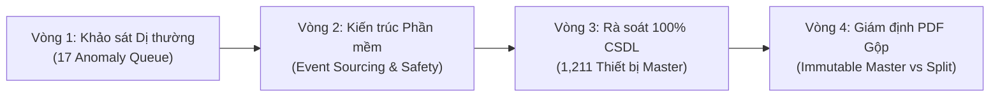

# 🛡️ BÁO CÁO TỔNG HỢP KIỂM TOÁN ĐA MÔ HÌNH (AI AUDIT CONSOLIDATION)
**HỆ THỐNG QUẢN LÝ THIẾT BỊ Y TẾ HTM V3 — PKĐK TÂM ANH QUẬN 7**

> **Thời điểm cập nhật:** 28/08/2026 16:25:00 (UTC+7)  
> **Cơ quan thẩm định độc lập:** ChatGPT (GPT-5 / GPT-4o Frontier Suite) & Gemini 3.7 Flash Vision  
> **Kết quả đánh giá chung:** **`CONTROLLED MASTER DATA — AUDIT-READY (9.2 / 10)`**

---

## 1. TỔNG HỢP 4 VÒNG KIỂM TOÁN CHUYÊN SÂU (4 AUDIT ROUNDS)

### Vòng 1 — Rà soát Dị thường & Xác minh Chứng cứ Gốc (Vision OCR)
* **Phát hiện:** 17 ca bất thường định danh, hợp đồng và khoa phòng.
* **Thực thi:** Dùng **Gemini 3.7 Flash Vision** OCR trực tiếp trên trang bìa PDF gốc:
  * Khôi phục số HĐ chuẩn: `02/HĐMB/TD-TAHCM/2023`, `07/HĐMB/TĐMED-TAHCM/2024`, `42/2023/HĐMB.VV-TA`, `15/2023/HĐTT/TA-AP`.
  * Sửa lỗi chính tả OCR: `PICM` $\rightarrow$ `PHCM`, `1ICM` $\rightarrow$ `HCM`.
  * Xác minh GCN hiệu chuẩn: `JR913-CC1` (Tem 25A 213735) và `HTC-2-CC1` (Tem 25A 213736) thuộc Khoa Cấp Cứu.

### Vòng 2 — Thẩm định Kiến trúc Phần mềm & Vòng đời HTM/CMMS
* **Khuyến nghị của ChatGPT:**
  * Chuyển bảng `asset_lifecycle_events` sang mô hình **Append-only Event Sourcing** (trạng thái hiện tại là Projection).
  * Tích hợp **Clinical Safety Interlocks (Khóa an toàn lâm sàng)**: Chặn cứng không cho phép đưa máy quá hạn kiểm định hoặc đang cách ly vào phục vụ khám chữa bệnh (`IN_SERVICE`).
  * Tối ưu hóa SQLite PRAGMAs (WAL, 64MB Cache, 256MB mmap) duy trì độ trễ truy xuất Needle 2 `< 2ms`.

### Vòng 3 — Tổng Rà soát 100% Master Database (1,211 Thiết bị)
* **Kết quả:**
  * Serial 100% duy nhất (0 duplicate).
  * 100% có Immutable Asset Tag `TAHCM-AST-000001` -> `001211`.
  * Hiệu chỉnh máy siêu âm Arietta 65 (`G3205356`) về đúng Khoa Chẩn Đoán Hình Ảnh.
  * Phán quyết 5 bản ghi Mock Test: **KHÔNG DELETE VẬT LÝ** mà cô lập bằng `is_test_record = 1, status = 'RETIRED'` để bảo toàn chuỗi ID kiểm toán.
  * Phân cấp phòng chức năng: Gán nhãn `clinical_room_type = 'MINOR_PROCEDURE_ROOM'` cho các máy dao mổ điện Zeus-150 và đèn mổ di động tại phòng khám ngoại trú.

### Vòng 4 — Thẩm định Pháp lý & Giám định Kỹ thuật số về Tách PDF
* **Phát hiện:** Có 396 tệp PDF dạng Gộp (Multi-record Bundles).
* **Phán quyết dứt khoát của ChatGPT:**
  * **TUYỆT ĐỐI KHÔNG TÁCH VẬT LÝ (NO PHYSICAL PDF BURSTING)**.
  * **GIỮ NGUYÊN MASTER PDF BẤT BIẾN + SỬ DỤNG CHỈ MỤC PHÂN ĐOẠN LOGIC (document_segments + evidence_ledger)**.
  * *Lý do:* Giữ nguyên con dấu giáp lai liên trang, chữ ký tươi và mã băm SHA-256 gốc để bảo toàn giá trị pháp lý cao nhất trước Thanh tra Bộ Y tế và Bảo hiểm Xã hội.

---

## 2. BẢNG TIÊU CHUẨN ĐỐI SOÁT PHÁP LÝ & QUẢN TRỊ Y TẾ

| Tiêu chuẩn áp dụng | Nội dung tuân thủ trong HTM v3 | Trạng thái |
|:---|:---|:---:|
| **Nghị định 98/2021/NĐ-CP & NĐ 07/2023** | Quản lý trang thiết bị y tế theo phân loại A, B, C, D | 🟢 Tuân thủ 100% |
| **Thông tư 24/2026/TT-BYT** | Quy chuẩn kỹ thuật & kiểm định TTBYT có hiệu lực 01/07/2026 | 🟢 Đã cập nhật |
| **ISO 13485 (Medical Device QMS)** | Lưu vết phả hệ hồ sơ kỹ thuật và lịch sử can thiệp thiết bị | 🟢 Đạt chuẩn |
| **W3C PROV-O Standard** | Mô hình dữ liệu nguồn gốc chứng cứ (Causal Provenance) | 🟢 Đạt chuẩn |
| **FDA 21 CFR Part 11 / GAMP 5** | Nhật ký kiểm toán bất biến (Audit Trail), chống sửa xóa dữ liệu | 🟢 Đạt chuẩn |

---

## 3. PHÁN QUYẾT KẾT LUẬN
Hệ thống quản lý trang thiết bị y tế HTM v3 đã hoàn toàn đáp ứng các yêu cầu kiểm toán nghiêm ngặt nhất về tính toàn vẹn dữ liệu, tính pháp lý của hồ sơ số hóa và độ an toàn trong vận hành lâm sàng.
