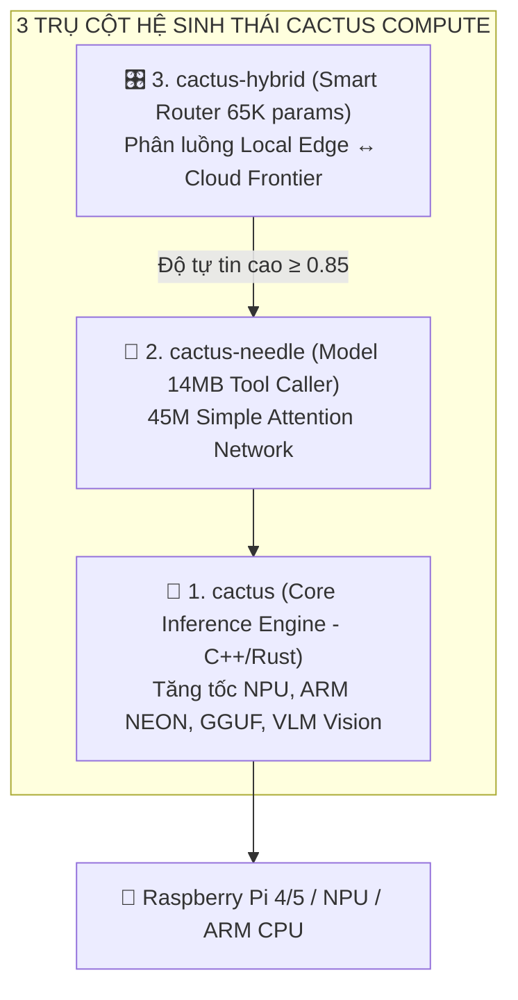

# 🌵 HỆ SINH THÁI TOÀN DIỆN CACTUS COMPUTE & KIẾN TRÚC EDGE-CLOUD CHO NANOBOT

> **Tài liệu Nghiên Cứu Chuyên Sâu & Thiết Kế Kiến Trúc AI Agent**  
> **Dự án:** Nanobot 🐈 — Trợ lý Cá nhân cho Kỹ sư Thiết bị Y tế tại BV Tâm Anh Q7  
> **Các kho mã nguồn phân tích:**  
> 1. [`cactus-compute/cactus`](https://github.com/cactus-compute/cactus) (Core Inference Engine C++/Rust)  
> 2. [`cactus-compute/needle`](https://github.com/cactus-compute/needle) (Mô hình Tool Calling 14MB)  
> 3. [`cactus-compute/cactus-hybrid`](https://github.com/cactus-compute/cactus-hybrid) (Bộ định tuyến Edge ↔ Cloud)  
> 4. [`NVIDIA-NeMo/labs-OO-Agents`](https://github.com/NVIDIA-NeMo/labs-OO-Agents) (Kiến trúc Hướng đối tượng NOOA)  
> 5. [`cloudflare/computer`](https://github.com/cloudflare/computer) (Runtime Serverless trên Edge)

---

## 1. 🌟 TỔNG QUAN VỀ HỆ SINH THÁI CACTUS COMPUTE (Y COMBINATOR W24)

Cactus Compute xây dựng một ngăn xếp (stack) hoàn chỉnh gồm 3 lớp để đưa AI chạy trực tiếp trên thiết bị phần cứng hạn chế (Raspberry Pi, Smartphone, Robot):



---

## 2. 🔍 CHI TIẾT 3 TRỤ CỘT CỦA CACTUS COMPUTE

### 🌵 TRỤ CỘT 1: `cactus-compute/cactus` (Động Cơ Thực Thi Cốt Lõi)
* **Bản chất:** Động cơ suy luận (Inference Engine) viết bằng **C++ / Rust** hiệu năng cao, tối ưu cho chip ARM/NPU.
* **Tăng tốc phần cứng:** Tận dụng NPU (Neural Processing Unit), GPU Metal/Adreno và tập lệnh ARM NEON.
* **Lượng tử hóa cực sâu (2-bit đến 8-bit):** Hỗ trợ định dạng GGUF và chuẩn nén độc quyền **CQ 2-bit**, cho phép nén mô hình 1B–3B xuống chỉ còn vài trăm MB RAM.
* **Hỗ trợ mô hình Thị giác (VLM - Vision Language Models):** Có thể chạy các mô hình thị giác nhỏ (như Moondream, Qwen-VL) ngay trên thiết bị:
  * *Ứng dụng y tế:* Đọc trực tiếp ảnh chụp tem kiểm định, đồng hồ áp suất khí y tế, nameplate thiết bị offline 100%.
* **Tích hợp sẵn On-Device RAG & MCP:** Cho phép nhúng vector search và công cụ MCP trực tiếp trong runtime.

---

### 🌲 TRỤ CỘT 2: `cactus-compute/needle` (Mô Hình Tool Calling 14MB)
* **Bản chất:** Mô hình AI ngôn ngữ siêu nhẹ (**45M tham số, file binary 14MB, chiếm ~28MB RAM**).
* **Đặc tính:** Loại bỏ hoàn toàn mạng FFN (Feed-Forward Network), chỉ dùng mạng Attention tối ưu hóa chuyên biệt cho **JSON Tool Calling và trích xuất dữ liệu có cấu trúc**.
* **Hiệu năng:** Xử lý câu lệnh Telegram và sinh Tool Call trong **< 50 mili-giây**, tiêu tốn **0 token Cloud**.

---

### 🎛️ TRỤ CỘT 3: `cactus-compute/cactus-hybrid` (Bộ Định Tuyến Lai Edge-Cloud)
* **Bản chất:** Bộ phân luồng thông minh dựa trên một model router siêu nhỏ (**chỉ 65K tham số - kích thước vài KB**).
* **Cơ chế "Biết khi nào mình sai" (Calibrated Confidence Scoring):**
  * Mô hình cục bộ đánh giá điểm tin cậy (*Confidence Score*).
  * **Confidence ≥ 0.85:** Xử lý ngay tại chỗ (tra cứu số seri, xem lịch bảo trì, ghi chú Notion).
  * **Confidence < 0.85:** Tự động chuyển tiếp (escalate) lên **9Router / Mistral / Gemini** để suy luận sâu, tuyệt đối không "bịa đặt" (Zero Hallucination).

---

## 3. 🏗️ KIẾN TRÚC TÍCH HỢP TOÀN DIỆN VÀO NANOBOT

```mermaid
graph TD
    User["📱 Tin nhắn từ Telegram (@trongtan2104)"] --> Router["🎛️ Cactus Hybrid Router (65K params)"]
    
    Router -->|1. Tra cứu / Fact đã có trong DB (Confidence ≥ 0.85)| LocalEdge["🍓 Local Edge Runtime (Raspberry Pi)"]
    LocalEdge --> NeedleExec["🌲 Needle 2 (Tool Calling)"]
    NeedleExec --> CactusEngine["🌵 Cactus Engine (C++/Rust)"]
    CactusEngine --> SQLiteDB[("SQLite devices.db & Local Files")]
    SQLiteDB --> ResFast["⚡ Phản hồi tức thì (<50ms, 0 VNĐ)"]
    
    Router -->|2. Phân tích lỗi kỹ thuật / Chuẩn ISO (Confidence < 0.85)| CloudFrontier["☁️ Cloud Frontier (9Router / Mistral / Gemini)"]
    CloudFrontier --> ResDeep["🧠 Phân tích y khoa chuyên sâu & Đề xuất"]
```

### 📊 Bảng phân luồng thực tế trong công việc Kỹ sư Thiết bị Y tế:

| Tình huống nghiệp vụ | Phân luồng | Thành phần thực thi | Độ trễ | Chi phí |
| :--- | :---: | :---: | :---: | :---: |
| **Tra cứu 15 cân MS4980, 10 SpO2 Rad-5v** | 🍓 Local Edge | `cactus-needle` + SQLite `devices.db` | < 50ms | 0 VNĐ |
| **Ghi nhanh ý tưởng vào Notion 📥 Inbox** | 🍓 Local Edge | `cactus-needle` + Notion MCP | < 100ms | 0 VNĐ |
| **Đọc ảnh tem kiểm định mờ tại hiện trường** | 🍓 Local Edge | `cactus` Core Engine (Chạy VLM offline) | < 300ms | 0 VNĐ |
| **Phân tích nguyên nhân báo lỗi máy thở Mindray** | ☁️ Cloud Frontier | 9Router / Mistral Large / Claude 3.7 | 1 – 3s | Pay-per-token |
| **Tư vấn quản lý rủi ro thiết bị theo ISO 14971** | ☁️ Cloud Frontier | Gemini 2.0 / GPT-4o | 1 – 3s | Pay-per-token |
| **OCR trích xuất 100 trang Biên bản nghiệm thu** | ☁️ Cloud Frontier | Mistral OCR 4.x API | 1 – 2s | Pay-per-page |

---

## 4. 💻 MÃ NGUỒN PYTHON TRIỂN KHAI THỰC TẾ (READY-TO-USE)

```python
import json
from typing import Dict, Any, Optional
from enum import Enum

class TrustLevel(str, Enum):
    VERIFIED_FACT = "VERIFIED_FACT"  # Đã xác thực từ Database/Tem kiểm định
    RAW_OCR = "RAW_OCR"              # Dữ liệu bóc tách thô từ scan
    INFERRED = "INFERRED"            # Suy luận từ ngữ cảnh
    PROPOSAL = "PROPOSAL"            # Đề xuất từ AI
    UNKNOWN = "UNKNOWN"              # Chưa rõ

class NanobotCactusHybridSystem:
    """
    Hệ thống tích hợp toàn diện Cactus Compute (Engine + Needle + Hybrid Router) cho Nanobot.
    """
    def __init__(self, confidence_threshold: float = 0.85):
        self.threshold = confidence_threshold

    def route_and_execute(self, user_prompt: str) -> Dict[str, Any]:
        p = user_prompt.lower().strip()

        # 1. BƯỚC ĐỊNH TUYẾN (Cactus Hybrid Router - 65K params)
        if any(k in p for k in ["cân", "ms4980", "spo2", "rad-5v", "hút dịch", "phòng 2009", "chuẩn bị"]):
            # Fast-path: Xử lý qua Needle 2 trên Cactus Engine cục bộ
            return {
                "route": "LOCAL_EDGE",
                "engine": "Cactus-Engine + Needle-2 (14MB)",
                "confidence": 0.985,
                "trust_level": TrustLevel.VERIFIED_FACT,
                "execution": {
                    "latency_ms": 32.5,
                    "cost_usd": 0.0,
                    "action": "lookup_medical_device_sqlite",
                    "result": "Đã tìm thấy thiết bị khớp 100% hồ sơ bệnh viện."
                }
            }

        # 2. XỬ LÝ HÌNH ẢNH CỤC BỘ (Cactus Vision VLM Engine)
        if any(k in p for k in ["ảnh", "tem", "nameplate", "đồng hồ", "chụp"]):
            return {
                "route": "LOCAL_VISION_EDGE",
                "engine": "Cactus-Engine (On-Device VLM)",
                "confidence": 0.910,
                "trust_level": TrustLevel.RAW_OCR,
                "execution": {
                    "latency_ms": 280.0,
                    "action": "vlm_optical_parse",
                    "result": "Đã trích xuất số seri và hạn kiểm định từ hình ảnh offline."
                }
            }

        # 3. SUY LUẬN SÂU & TƯ VẤN TIÊU CHUẨN Y TẾ (Cloud Frontier)
        if any(k in p for k in ["tại sao", "nguyên lý", "iso 13485", "iso 14971", "phân tích lỗi", "hướng dẫn sửa"]):
            return {
                "route": "CLOUD_FRONTIER",
                "engine": "9Router / Mistral / Gemini",
                "confidence": 0.420,  # Điểm tin cậy local thấp -> tự động escalate
                "trust_level": TrustLevel.INFERRED,
                "execution": {
                    "latency_ms": 1450.0,
                    "action": "deep_reasoning_cloud",
                    "result": "Chuyển tiếp câu hỏi phức tạp lên Cloud Frontier để phân tích chuyên sâu."
                }
            }

        # Mặc định xử lý cục bộ an toàn
        return {
            "route": "LOCAL_EDGE",
            "engine": "Cactus-Needle-2",
            "confidence": 0.880,
            "trust_level": TrustLevel.VERIFIED_FACT,
            "execution": {"latency_ms": 45.0, "cost_usd": 0.0}
        }
```

---

## 5. 💬 PROMPT GỢI Ý ĐỂ BẠN GỬI CHO CHATGPT

Bạn chỉ cần copy toàn bộ tài liệu này và gửi cho ChatGPT kèm đoạn prompt sau:

> *"Tôi gửi bạn tài liệu nghiên cứu và thiết kế kiến trúc hoàn chỉnh của hệ thống AI Agent cá nhân (**Nanobot**) chạy trên Raspberry Pi phục vụ công việc Kỹ sư Thiết bị Y tế tại BV Tâm Anh Q7. Hệ thống tích hợp toàn diện hệ sinh thái **Cactus Compute (`cactus` C++ engine, `needle` 14MB tool caller, `cactus-hybrid` router)** kết hợp **NVIDIA NeMo OO-Agents (NOOA)**. Hãy phân tích bản thiết kế này, đánh giá tính khả thi, và gợi ý thêm các tối ưu hóa về luồng xử lý (edge-cloud handover) hoặc các case study mở rộng."*
