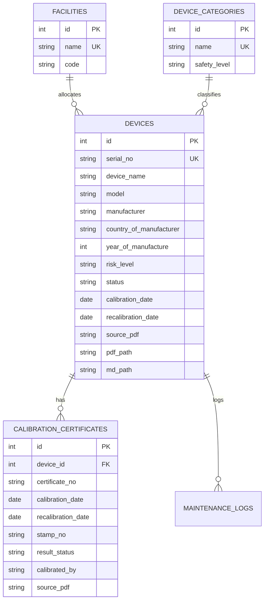

# Technical Plan: 001 - Medical Device Management System

## 1. Architecture & Tech Stack
- **Backend:** Python 3.14 + FastAPI + SQLite (WAL mode, Foreign Keys ON).
- **Frontend:** Vanilla HTML5, Modern CSS / Bootstrap 5, Bootstrap Icons, Native ES6 JavaScript.
- **Data Ingestion:** Batch parser reading YAML frontmatter from `G:\BV QUẬN 7_OCR_WORK_20260712\md` and linking to `G:\BV QUẬN 7_OCR_WORK_20260712`.
- **API Documentation:** Interactive Swagger UI at `/docs`.

---

## 2. Database Schema Design

---

## 3. REST API Contract

| Endpoint | Method | Params / Payload | Description |
| :--- | :--- | :--- | :--- |
| `/api/devices` | GET | `facility_id`, `category_id`, `alert_status`, `status`, `search`, `limit`, `offset` | Danh sách thiết bị lọc đa tiêu chí |
| `/api/devices/{id}` | GET | Path: `id` | Chi tiết lý lịch máy & lịch sử kiểm định |
| `/api/dashboard/summary` | GET | None | KPI: Tổng máy, Đạt chuẩn, Cảnh báo 30 ngày, Quá hạn |
| `/api/dashboard/facilities` | GET | None | Danh sách 22 khoa phòng kèm số lượng thiết bị |
| `/api/dashboard/categories` | GET | None | Danh sách các nhóm thiết bị |
| `/api/pdf/view` | GET | `filename` | Mở & stream trực tiếp file PDF gốc từ ổ G: |

---

## 4. UI / UX Design Principles
- **Snipe-IT Influences:** Phân loại rõ ràng, mã Tag / Serial nổi bật, hiển thị khoa phòng, nhãn mã QR Code.
- **SpeedMaint CMMS Influences:** Cảnh báo bảo trì & kiểm định theo mã màu (Đỏ = Quá hạn, Vàng = < 30 ngày, Xanh = OK), modal lý lịch chi tiết.
